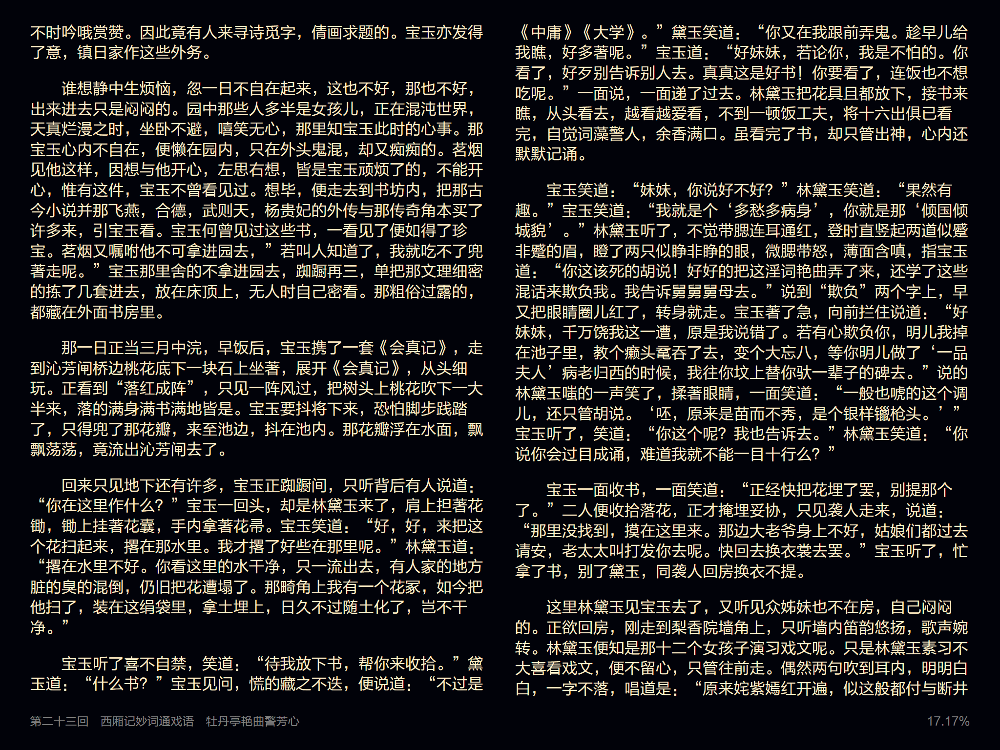
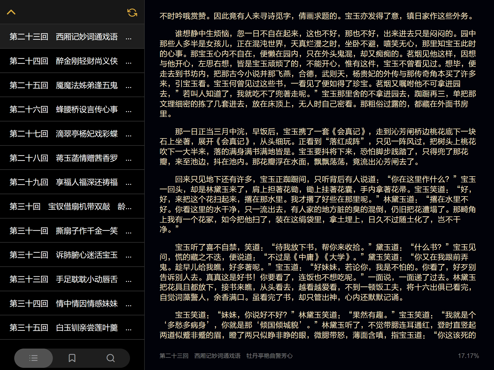

# tReader

https://tiansh.github.io/reader

又一个 TXT 文本阅读器。

自用为主。

## 使用

Safari 打开 https://tiansh.github.io/reader ，选择“添加到主屏幕”，从主屏幕上找到并打开，就可以开始用了。

Android 设备的话可能需要 Chrome 浏览器打开。作者没试过。

### 文件列表

* 点左上角的添加按钮可以添加文件：
    * 文件可以从本机、iCloud 或者 OneDrive、MEGA 之类的地方选择。
    * 如果文件打开乱码，请考虑使用 UTF-8 保存文件。
* 点右上角可以进入设置。
* 文件列表，左滑、右键或按<kbd>Delete</kbd>可以显示删除按钮。

### 设置

* 主题的自动模式会跟随系统设置，兼容系统设置的定时暗色模式等。
* 字体设置可以载入字体文件，支持的文件类型受限于使用的浏览器。Safari 支持 \*.ttf 格式的字体。*
* 语言标记用于标记文章的语言。设置后浏览器会自动为 CJK 兼容字符选择你设置的语言对应的字体。
    * 如果需要设置为简体中文，可以填写 `zh-Hans`。
* 预处理操作只会在文件导入时执行一次，设置后可能需要重新添加文件。
* 朗读中可以选择的语音是系统中安装的语音：
    * 标记为“远程”的语音受网络因素影响，可能发生卡顿现象。

### 阅读

* 翻页模式阅读界面的基本操作
    * 上一页：向右滑（触屏），点按右侧，滚轮上，<kbd>←</kbd>，<kbd>PgUp</kbd>
    * 下一页：向左滑（触屏），点按左侧，滚轮下，<kbd>→</kbd>，<kbd>PgDown</kbd>
    * 显示菜单：向上滑（触屏），点按中间，右键，<kbd>↑</kbd>，<kbd>Escape</kbd>，<kbd>Tab</kbd>
    * 显示目录，书签或搜索：向下滑（触屏），<kbd>↓</kbd>
* 滚动模式阅读界面的基本操作
    * 向回翻：向下滑（触屏），点按上方，滚轮上，<kbd>↑</kbd>，<kbd>PgUp</kbd>
    * 向后翻：向上滑（触屏），点按下方，滚轮下，<kbd>↓</kbd>，<kbd>PgDown</kbd>
    * 显示菜单：向左滑（触屏），点按中间，右键，<kbd>←</kbd>，<kbd>Escape</kbd>，<kbd>Tab</kbd>
    * 显示目录，书签或搜索：向右滑（触屏），<kbd>→</kbd>
* 目录：
    * 点右上角的刷新图标可以生成或刷新目录，会要求输入目录的模板。
    * 如果书中每个章节的标题采用“第三章　章节标题”这样的格式，那么目录模板就填写“第\*章 ”。
    * 用“/”开头和结尾的话可以写正则表达式。
* 书签：
    * 点右上角可以添加书签。
* 搜索：
    * 搜索时每行只匹配第一个结果，所以如果一行里面出现多次也只会匹配出来第一次。

Android 的话作者没试过，有问题欢迎 PR。计算机上、以及 iOS Safari 上不能复现的问题，作者可能没法处理。

## 开发

直接使用任意的静态 HTTP 服务器服务 src 目录即可。无需编译。

因为使用了 Service Worker 作为离线存储，你的修改可能无法实时在浏览器中得到体现。为此，你可以调整浏览器设置，或从 `main.js` 中临时注释掉相关的代码以方便调试。

更改配色可以参考 `light.css`, `dark.css` 文件。更改阅读界面的样式可以参考 `readpage.css`。

## 截屏





<!--
截屏中的《红楼梦》（曹雪芹、高鹗），因作者逝世已超过100年，文章属于公有领域
下载自维基文库，经过编辑。导入时启用了繁简转换。
-->

## 常见问题

### 填写目录模板

阅读器没有预置识别目录的模板。如果你需要识别目录，需要自行填写目录模板。如果目录所在行的格式如上图所示“第二十三回　西厢记妙词通戏语　牡丹亭艳曲警芳心”，那么填写“第\*回 ”即可。

目录模板中，“\*”表示此处可以出现任意数量的任意字符，使用半角空格表示此处可以出现任意空白字符。目录匹配时会要求目录行以给定模板的内容开头，前面不能有除空白字符以外的内容。

除使用通配符外，使用“/”开头并结尾，也可以填写正则表达式（ECMAScript）。

### 汉字字体错误/西文换行错误

阅读器无法推断文章的语言，根据您的浏览器的设置不同，浏览器可能为汉字选用默认的字体。因此有可能为简体中文的文章选择了日语字体。导致显示的一些汉字出现笔画显示上与读者习惯不符的问题。同样的问题也出现在西文的换行上，浏览器可能默认使用英语的换行方式处理如德语的文章。

如果您遇到此类问题，请在设置中填写语言标记，标明阅读的文章的语言。例如简体中文 `zh-Hans`，繁体中文 `zh-Hant`。

此外，您还可以通过载入 ttf 文件定制字体。

### 开启语音朗读后不能正常朗读且快速翻页

语音朗读会使用系统中安装的语音。不同的语音针对不同的语言和地区。在阅读中文内容时，可能需要首先在设置中选择中文的朗读语音。这些语音一般以 `zh-` 开头。如果使用默认的英语朗读语音，朗读时会自动跳过汉字，导致快速翻页。

### 希望添加某某功能

因为 Web APP 的限制，以下功能 iOS 上目前没法支持：

* 旋转锁定<sup>[\[MDN\]](https://developer.mozilla.org/en-US/docs/Web/API/ScreenOrientation)</sup>
* 背光亮度调整
* 保持屏幕唤醒<sup>[\[Chrome\]](https://chromestatus.com/feature/4636879949398016)</sup>
* 隐藏手机顶部的信号与电量信息
* 后台播放语音朗读
* 切换应用时隐藏屏幕快照
* 从其他应用的分享菜单中选择本应用<sup>[\[Chrome\]](https://web.dev/web-share-target/)</sup>

所以如上相关的各种问题就不用再问我了。

但如果你要针对 Android 做任何上述功能，还是欢迎 PR。

## 高级设置

```ini
[appearance]
; 当屏幕宽度达到如下值时，目录信息使用侧栏显示
screen_width_side_index=960
; （仅翻页模式）当屏幕宽度达到如下值时，使用两栏模式显示
screen_width_two_column=960
; （仅翻页模式）当屏幕宽度达到如下值时，即便显示了侧边栏目录，仍然使用两栏模式显示
screen_width_two_column_index=1260
; （仅滚动模式）在屏幕外预加载的文本数量，设置更大的数字以加载更多文本
text_buffer_factor=1
; （仅滚动模式）文本区域的最大宽度
scroll_max_text_width=800
; 添加自定义 CSS
custom_css=

[text]
; 逐个尝试以下字符编码读取 txt 文件
; 如果遇到解析错误会自动尝试下一种字符编码
; 使用最后一种字符编码解析时，如果遇到错误会解析成豆腐字符
; 该项设置仅影响导入 txt 时的行为，对导入完成的 txt 无影响
encoding=utf-8,gbk,big5,utf-8
; 生成目录时，仅考虑长度不超过如下值的行
contents_max_length=100
; 生成目录时，如果识别到的目录条目数量超过如下限制，会拒绝生成目录
contents_size_limit=2000

[speech]
; 语音朗读时，单条语音最多的字数
max_char_length=1000
; 语音朗读时，预先调度的语音条数
queue_size=10
; 显示媒体会话界面
media_session_enable=false
; 语音朗读忽略满足如下正则（ECMAScript）的文本行
skip_text_regex=/^\s*$/u
; 语音朗读遇到文章结尾时自动从开头重读
loop_enable=false
; 页面切换到后台时暂停朗读
pause_on_hidden=false
```

请谨慎配置高级设置功能，错误配置可能造成显示错误甚至完全无法使用。

## Open Source Credits

* normalize.css: from normalize v8.0.1
    * MIT License; https://github.com/necolas/normalize.css
* icon.svg / icon.woff based on Feather
    * MIT License; https://github.com/feathericons/feather
* s2t.json, t2s.json Chinese traditional / simplified translation tables based on OpenCC
    * Apache License 2.0; https://github.com/BYVoid/OpenCC
    * For more details about the modification, see https://github.com/tiansh/opencc-fsm

## About

Copyright (C) 2020-2021 田生

This project is released under the Mozilla Public License 2.0 with no copyleft exception. You may checkout LICENSE file for more detail.

